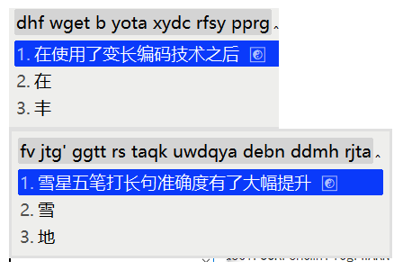

# rime-snomiao iRime


- Language: [English] | [简体中文](./README.chs.md)

## List of Plans/Features

### Snowstar-Wubi ⌨️



- Improved variable-length encoding technology based on the Microsoft Wubi code table, greatly enhancing the efficiency of long sentence input in Wubi

## Installation and Configuration 🗳️

### Install in Mac, Use with OSX 🍎

1. Install Squirrel here (branch for Rime on Mac).

   1. [rime.im](https://rime.im) (official website)
   2. or `brew install squirrel --cask`

2. Install rime-snomiao receipe.

   ```shell
   git clone https://github.com/snomiao/rime-snomiao
   cd rime-snomiao
   git pull origin
   cp -r ./* ~/Library/Rime/
   ```

1. In the upper right corner of the screen, in the input method drop-down menu, click on 'Deploy' to load.

- TODO, PR's welcome.

### Install on Windows 🪟

1. Firstly, install the Weasel input method,
   Official website: [Download and Installation | RIME | Zhongzhou Rhyme Input Method Engine](https://rime.im/download/)
   or use Chocolatey to install `cup weasel`

2. Install this input scheme

- Method 0
  - Download the Release and then unzip it to `C:\Users\Your username\AppData\Roaming\Rime`
  - https://github.com/snomiao/rime-snomiao/releases/
- Method 1
  - Download, unzip this project and copy the content of `./Rime` folder to: `C:\Users\Your username\AppData\Roaming\Rime` (i.e., %APPDATA%\Rime )
  - [Configure](#configure) the input method (or restart the system)
  <!-- - Method 2
  - Run
    ````
    git clone https://github.com/snomiao/rime-snomiao
    cd rime-snomiao
    git pull
    cd devtools
    install.bat
    ``` -->
- Method 3 (Automatic)
  - Run `npx rime-snomiao@latest`
    Please note that this input scheme cannot use Dongfeng Po (plum) to install.

1. After the installation is complete, please [configure](#configure) the input method


### Linux 🐧

- TODO, PR’s welcome

## Configuration

| WeaselDeployer.exe          | F4                          |
| --------------------------- | --------------------------- |
|  |  |

### Custom

You can modify the emoticons in [kaomoji.dict.yaml](./kaomoji.dict.yaml) (not used by default, need to be manually imported)

- [Emoji](./Rime/opencc/zh_emoji_word.json)
- [JPN Japanese 日本語 Scheme](./Rime/sno_japanese.schema.yaml)
- [CHN Chinese 中国語 Scheme](./Rime/sno_chinese.schema.yaml)

Pinyin can be changed in ``

```yaml
dependencies:
  - pinyin_simp
```

You can replace Wubi with 98 or others, at the following location

```yaml
translator:
  dictionary: wubi86
```

## Dictionary contribute 詞典贡献

Dictionary contribute 詞典贡献

1. fork rime-snomiao to your account, and clone to local
2. put this dictionary into /dict
3. git commit -a -m "YOUR dictionary NAME"
4. git push
5. view your forked branch in github
6. PR button should shown, click it

## LICENSE

This project is Copyleft, take it if you love it.

(But if you need it for commercial purposes, be aware of the licenses of the other few schemes included in the project (but there shouldn't be such people ...), if you have this requirement, please refer to Reference and go in to see their License for yourself)

## rime-snomiao Social Network

telegram: @rime_snomiao https://t.me/rime_snomiao

## References & ThanksTo

- [Full Emoji Database](https://www.kaggle.com/datasets/eliasdabbas/emoji-data-descriptions-codepoints?resource=download)
- [中日英自然码（带辅码）双拼输入法](https://github.com/lippmann/lrime)
- [Rime double pinyin plus](https://github.com/mutoe/rime)
- [OpenCC](https://github.com/BYVoid/OpenCC)
- [rime/rime-pinyin-simp: 【袖珍簡化字拼音】輸入方案](https://github.com/rime/rime-pinyin-simp)
- [rime/rime-wubi: 【五筆字型】輸入方案](https://github.com/rime/rime-wubi)
- [gkovacs/rime-japanese: 日语输入法 Input method for typing Japanese with RIME](https://github.com/gkovacs/rime-japanese/)
- [日本人名地名平假名汉字双向词典](https://mdict.org/post/riben-renming-diming/)
- [Mouse Dictionary](https://github.com/wtetsu/mouse-dictionary/wiki/Download-dictionary-data)

## About

### Author 👩‍💻

Author: snomiao <snomiao@gmail.com>
Website: [snomiao.com](https://snomiao.com)

### Sponsors 💰

- None yet.

Claim your sponsorship by donating snomiao <[Email: snomiao@gmail.com](mailto:snomiao@gmail.com)>

### Contribute 💻

The main repo is in [here](https://github.com/snomiao/rime-snomiao#readme), any issue and PR's welcome.

### Published 📰

rime-snomiao 雪星的小狼毫输入法方案

- [github.com/snomiao](https://github.com/snomiao/rime-snomiao)
- [gitee.com/snomiao](https://gitee.com/snomiao/rime-snomiao)
- [github.com/rime/home](https://github.com/rime/home/issues/68#issuecomment-1383913014)
- [Zhihu](https://zhuanlan.zhihu.com/p/599268754)
- [Telegram Rime](https://t.me/loverime/41196)
- [V2EX](https://www.v2ex.com/t/909117)
- [Twitter](https://twitter.com/snomiao/status/1614586337822375936)

