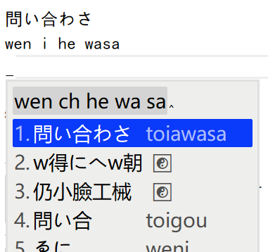
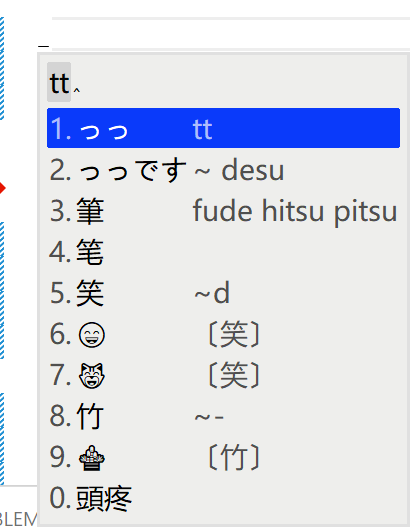
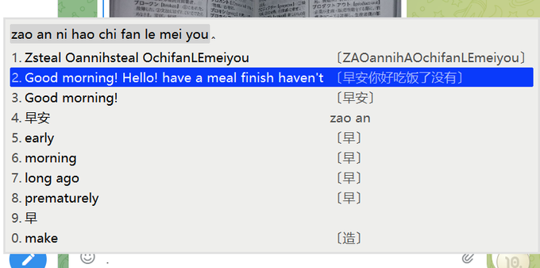
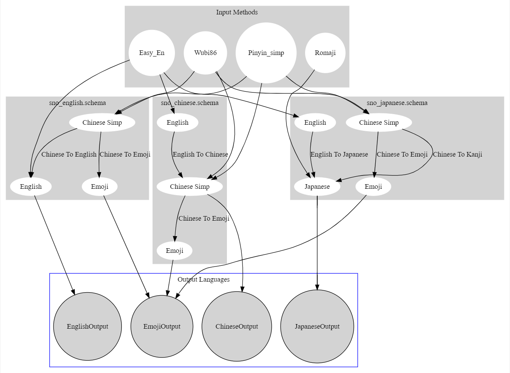
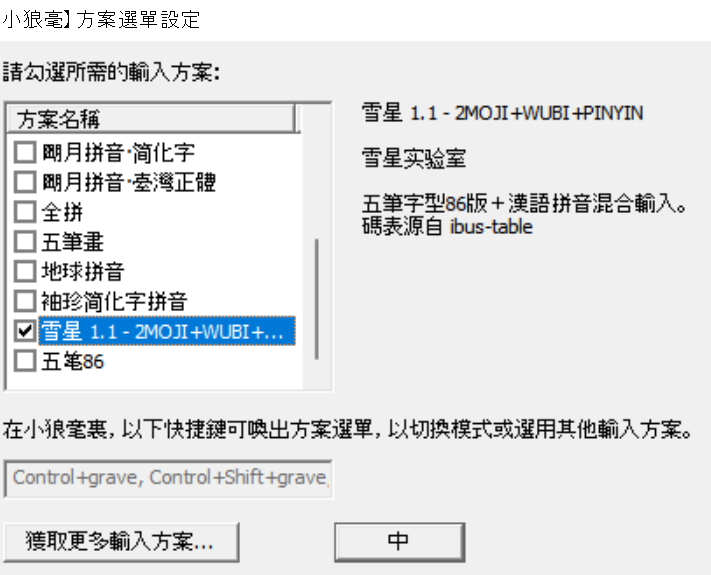
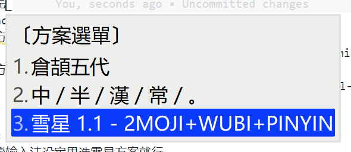

# rime-snomiao 雪星的小狼毫输入法方

本方案主要解決以下問題：

- 用日語輸入法不会打中文，中文輸入法打不了日語，老要切換，怎麼辦？（拼日混打）
- 並且系統自帯日語輸入法也不能直接打英文……（rime 直接 enter）
- 会英文，在学日語，想知道一個単詞的日語怎麼説？（英語単詞翻訳日語）
- 会中文，在学日語，想知道同一個字怎麼用日語打？（反查日語）
- 会五笔，但是有些字反映不過来想用拼音打。（五笔拼音混打）
- 有時候想打些 emoji 😈。（漢字转 emoji）
- 同時実現以上夢想（使用本方案）

## 方案列表/特性

### 雪星日本語（+漢字転和字 +英翻日）

- 日本語(Romaji) + 拼音和字 + 五筆 86 和字 + Emoji 混合輸入
- 輸入 english 輸出 日本語（即単詞翻訳）
- 自動転換成日本語詞組
- 所有輸出反查日本語编码

#### 漢日混打 -- wen i he wasa => 問い合わさ



- 用日語輸入法不会打中文，中文輸入法打不了日語，老要切換，怎麼辦？
- 会中文，在学日語，想知道同一個字怎麼用日語打？

本方案兼容輸入拼音和平仮名混合輸入並且輸出日語詞彙。

（完美兼容偷懶直接按中文念漢語，仮名念日語的壊習慣…… eh maybe 会让你養成壊習慣 XD）

#### 中文混合輸入



輸入 tt 同時輸出：日本語つつ，繁体五筆，簡体五笔，顔文字（由“派生”，竹（五笔，繁簡一致），頭疼（拼音簡打））
同時，123 反査日語打法，58 反査五笔打法，emoji 反查関連漢字

### 雪星中文（+英翻中）

- 五笔 86 + 拼音 + Emoji 混合输入
- 反查 86 编码
- 詳情見下图

### 雪星英文（+中翻英）



- Wubi86 + Pinyin -> 翻訳成英文
- English + Emoji 混合输入
- 詳情見下图吧

### Input -> Output Diagram



## 安装与配置

### Install in Mac、OSX に使用する

1. Install squirrel by 在这里安装 squirrel （rime の mac に分支）。
   1. [rime.im](https://rime.im)
   2. or `brew cask install squirrel`
   3.
2. Install rime-snomiao receipe 安装 rime-snomiao receipe

   ```shell
   git clone https://github.com/snomiao/rime-snomiao
   cp -r rime-snomiao/Rime/* ~/Library/Rime
   ```

3. 屏幕右上角，输入法下拉菜单，点击 Deploy 载入

- TODO, PR’s welcome

### 在 Windows 安裝

1. 首先安装 Weasel 输入法，
   官方网站：[下載及安裝 | RIME | 中州韻輸入法引擎](https://rime.im/download/)
   或使用 Chocolatey 安装 `cup weasel`
2. 安装本输入方案

   - 方法 1
     - 將本項目下載解压，将 `./Rime` の内容复制到：`C:\Users\你的用户名\AppData\Roaming\Rime` (即 %APPDATA%\Rime )
     - [配置](#配置) 输入法
   - 方法 2（需要連接互聯網）
     - 運行 `cmd /k cd "C:\Program Files (x86)\Rime\weasel-*\" && rime-install.bat`
     - 輸入 `snomiao/rime-snomiao`
     - [配置](#配置) 输入法
   - 方法 3
     - 運行 `git clone https://github.com/snomiao/rime-snomiao && cd rime-snomiao && install.bat`
   - 方法 4 （自动）
     - 運行 `npx rime-snomiao`

3. 安装完成后，请 [配置](#配置) 输入法

### Linux

- TODO, PR’s welcome

## 配置

| WeaselDeployer.exe          | F4                          |
| --------------------------- | --------------------------- |
|  |  |

### Custom / カスタム / 自定義

顔文字在 [kaomoji.dict.yaml](./kaomoji.dict.yaml) 里修改（黙認不使用，需要手動引入）

- [Emoji / 絵文字 / Emoji](./Rime/opencc/zh_emoji_word.json)
- [Pinyin Schema 拼音方案](./Rime/sno_pinyin.schema.yaml)
- [Japanese Schema 日本語方案 ](./Rime/sno_japanese.schema.yaml)

拼音可以在 `` 里改

```yaml
dependencies:
  - pinyin_simp
```

五笔可以自己换 98 或别的，位置如下

```yaml
translator:
  dictionary: wubi86
```

## Dictionary contribute 詞典贡献

Dictionary contribute 詞典贡献

1. fork rime-snomiao to your account, and clone to local
2. put this dictionary into /dict
3. git commit -a -m "YOUR dictionary NAME"
4. git push
5. view your forked branch in github
6. PR button should shown, click it

## 授权

本項目 Copyleft，本項目爱用就拿去。

（但如果需要做商用的話得注意項目中包含的其它幾個方案的 license（但应该没有這様的人吧……），如果有這種需求請参見 Reference 电進去自己看他們的 License）

## Reference & ThanksTo

### rime-snomiao 小白鼠用户交流群

telegram: @rime_snomiao https://t.me/rime_snomiao

- [中日英自然码（带辅码）双拼输入法](https://github.com/lippmann/lrime)
- [Rime double pinyin plus](https://github.com/mutoe/rime)
- [OpenCC](https://github.com/BYVoid/OpenCC)
- [rime/rime-pinyin-simp: 【袖珍簡化字拼音】輸入方案](https://github.com/rime/rime-pinyin-simp)
- [rime/rime-wubi: 【五筆字型】輸入方案](https://github.com/rime/rime-wubi)
- [gkovacs/rime-japanese: 日语输入法 Input method for typing Japanese with RIME](https://github.com/gkovacs/rime-japanese/)

## About

### Author

Author: snomiao <snomiao@gmail.com>
Website: [snomiao.com](https://snomiao.com)

### Sponsors

- None yet.

Claim your sponsorship by donating snomiao <[Email: snomiao@gmail.com](mailto:snomiao@gmail.com)>

### Contribute

The main repo is in [here](https://github.com/snomiao/rime-snomiao#readme), any issue and PR's welcome.

### Published

- [Telegram Rime](https://t.me/loverime/41196)
- [Twitter](https://twitter.com/snomiao/status/1614586337822375936?s=20)
- 