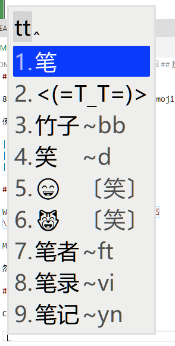

# 雪星的小狼毫输入法方案

由以下方案混合： 86 版五笔 | 拼音 | Emoji | 顔文字（Kaomoji) | 日本語

例图：

## Feat 特性

- 雪星五笔
  - `ctrl+shift+n` 切换
  - 五笔 86 + 拼音 + 顔文字 + Emoji 混合输入
  - 拼音反查五笔 86 编码
- 雪星日本語
  - `ctrl+shift+j` 切换
  - 日本語 + 拼音 混合输入
  - 拼音反查日本語编码

## 安装与配置

### 在 Windows 安裝

1. 首先安装 Weasel 输入法，
   官方网站：[下載及安裝 | RIME | 中州韻輸入法引擎](https://rime.im/download/)
   或使用 Chocolatey 安装 `cup weasel`
2. 安装本输入方案

- 方法 1
  - 將本項目下載解压，将 `./Rime` の内容复制到：`C:\Users\你的用户名\AppData\Roaming\Rime` (即 %APPDATA%\Rime )
  - [配置](#配置) 输入法
- 方法 2（需要連接互聯網）
  - 運行 `cmd /k cd "C:\Program Files (x86)\Rime\weasel-*\" && rime-install.bat`
  - 輸入 `snomiao/rime-snomiao`
  - [配置](#配置) 输入法
- 方法 3
  - 運行 `git clone https://github.com/snomiao/rime-snomiao && cd rime-snomiao && install.bat`
- 方法 4 （自动）
  - 運行 `npx rime-snomiao`

1. 安装完成后，请 [配置](#配置) 输入法

### Mac

1. Install squirrel by:
   1. [rime.im](https://rime.im)
   2. or `brew cask install squirrel`
2. Install recipe
   ```shell
   git clone https://github.com/snomiao/rime-snomiao
   cp rime-snomiao/Rime/* ~/Library/Rime
   # and then you must reload squrriel
   ```

- TODO, PR’s welcome

### Linux

- TODO, PR’s welcome

## 配置

| WeaselDeployer.exe          | F4                          |
| --------------------------- | --------------------------- |
|  |  |

## 自定义

顔文字在 [kaomoji.dict.yaml](./kaomoji.dict.yaml) 里修改

Emoji 在 `opencc` 文件夹里可以修改

拼音可以在 `snomiao.schema.yaml` 里改

```yaml
dependencies:
  - pinyin_simp
```

五笔可以自己换 98 或别的，位置如下

```yaml
translator:
  dictionary: wubi86
```

## 授权

Copyleft，爱用就拿去

## Reference & ThanksTo

wubi86
- [中日英自然码（带辅码）双拼输入法](https://github.com/lippmann/lrime)
- [Rime double pinyin plus](https://github.com/mutoe/rime)
- [OpenCC](https://github.com/BYVoid/OpenCC)
