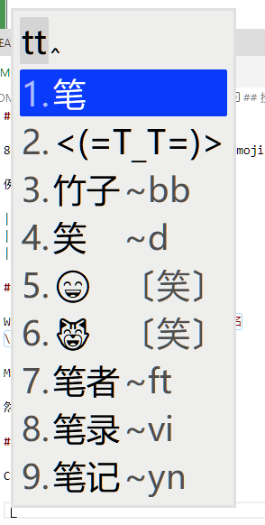

# 雪星的小狼毫输入法方案

86五笔 + 拼音 | Emoji
顔文字（Kaomoji)

例图：

## 安装

Windows 解压到：`C:\Users\你的用户名\AppData\Roaming\Rime`

Mac 和 Linux 用户自己找自己的目录哈

然后输入法设定里选雪星方案就行

## 自定义

顔文字在 `kaomoji.dict.yaml` 里修改

Emoji在 `opencc` 文件夹里可以修改

拼音可以在 `snomiao.schema.yaml` 里改
```yaml
dependencies:
    - pinyin_simp
```

五笔可以自己换98或别的，位置如下
```yaml
translator:
  dictionary: wubi86
```


## 授权

Copyleft，爱用就拿去
